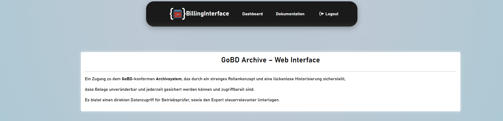
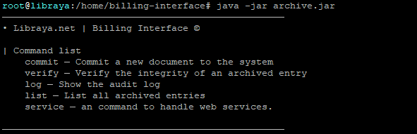
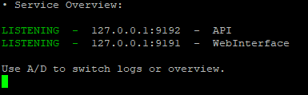
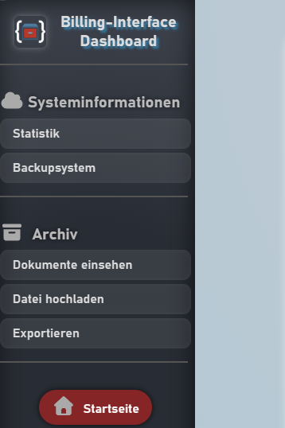
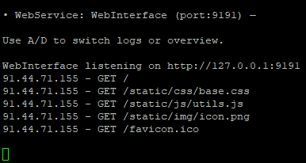

#  BillingInterface (GoDB-Archive)   
Ein GoBD-orientiertes Archivsystem  
*(in Entwicklung)*



---

## 📌 Überblick

**BillingInterface** ist ein Archivsystem, das langfristig vollständig **GoBD-konform** arbeiten soll.  
Das Projekt dient als **technische Demonstration im Rahmen einer Ausbildungsbewerbung** und befindet sich aktiv im Ausbau.

Das System bietet:

- ein **CLI** zur direkten Steuerung  
- einen **ServiceHandler** mit **TUI**, um Webdienste wie Webserver & API zu verwalten  
- ein **Webinterface** zur Archivverwaltung, sowie als Zugang für Betriebsprüfer 
- eine **REST-API** mit API-Key Authentifizierung  
- eine **MySQL-basierte, anpassbare Benutzerverwaltung** für das Webinterface  
- flexible **Konfiguration über `.env` und weitere Konfigurationsdateien**  
- ein **GoBD-orientiertes Archivierungsmodell** mit Audit-Log und Metadaten
- eine einfache [Templating-Language](/TEMPLATING_README.md) inspiriert von Jinja2

> ⚠️ **Wichtig:**  
> Das Projekt ist **ausschließlich unter Linux lauffähig**, da Terminal-Steuerung, Dateirechte und Systembefehle Linux-spezifisch sind.

---

## 🧩 Architektur

### 1. **CLI**



CLI Anwendungsbeispiel:

```bash
java -jar archive.jar ws full --serve
```

oder je nach Konfiguration:

```bash
billing-interface ws full --serve
```

### 2. **ServiceHandler (mit TUI)**



Der ServiceHandler:
- startet und "überwacht" Webdienste (Webserver, API, etc.)
- bietet ein TUI, das über die Tastatur steuerbar ist (A/D Navigation)
- zeigt Live-Logs der einzelnen Services an
- besitzt eine Statusübersicht der Dienste (Index -1)
Die Logs werden nicht gespeichert, sondern nur live angezeigt — GoBD-relevant ist ausschließlich das Audit-Log des Archivsystems.

### 3. Webserver & Webinterface




Das Webinterface:
- kommuniziert ausschließlich über Web-Routen, nicht direkt mit der API
- nutzt eine MySQL-basierte Benutzerverwaltung
- ist vollständig konfigurierbar
- unterstützt zukünftig Datei-Uploads, Queries, Exporte, Verifizierungen und mehr.

### 4. REST-API
Die API ist nicht direkt vom Frontend erreichbar, sondern wird über interne API-Routen angesprochen.
Sie soll später u.a. den Austausch zwischen dem Backup-Archiv und dem Hauptarchiv ermöglichen.

### 5. Authentifizierung & Sicherheit
**API-Key**
- Wird in der .env konfiguriert

Webinterface-Login
- Benutzer werden aus einer MySQL-Datenbank geladen
- Sessions werden serverseitig verwaltet
- Anpassungsfähig auf verschiedene MySQL- Tabellen.


## **Installation & Start**
### 1. JAR erstellen
```bash
mvn clean package
```

### 2. `.env` erstellen

```bash
cp .env.template .env
```

### 3. Programmstart & Konfiguration

3.1 - Einmalig zur Erstellung der Konfigurationsdateien starten

```bash
cd /pfad/zur/jar
java -jar archive.jar
```

3.2 - Konfigurationsdateien bei Bedarf anpassen

3.3 - Beispielstruktur der benötigten MySQL- Benutzertabelle:

```ddl
-- billinginterface.users definition
CREATE TABLE `users` (
  `id` int(11) NOT NULL AUTO_INCREMENT, -- erforderlich
  `email` varchar(255) DEFAULT NULL, -- erforderlich
  `password` varchar(64) DEFAULT NULL, -- erforderlich
  `group_id` int(11) NOT NULL, -- erforderlich
  `name` varchar(32) DEFAULT NULL,
  `surname` varchar(32) DEFAULT NULL,
  `company` varchar(32) DEFAULT NULL,
  PRIMARY KEY (`id`)
) ENGINE=InnoDB AUTO_INCREMENT=3 DEFAULT CHARSET=utf8mb4 COLLATE=utf8mb4_uca1400_ai_ci;
```

> **Info:**
> Die **erforderlichen** Spalten können konfiguriert werden. Sollte die konfigurierte Tabelle nicht bereits bestehen,
  wird diese beim nächsten Start nach Konfiguration erstellt (der in der .env konfigurierte Benutzer benötigt die Berechtigung).
  

### 4. Programmstart (Webinterface & API)
```bash
cd /pfad/zur/jar
java -jar archive.jar ws full --serve
```

## Windows und macOS- Testmodus
> Da Linux-spezifische Funktionen verwendet werden (z.B. die Terminalsteuerung oder die Dateirechte), 
  lässt sich das Programm nur auf Linux Betriebssystemen ausführen.
  Der Parameter ``--bypass`` muss an jeden Befehl angehängt werden,
  um Befehle dennoch ausführen zu können. 
  
>  Bsp.:

```bash
java -jar archive.jar ws full --serve --bypass
```

## Optionaler Alias

```bash
alias billing-interface='cd /opt/gobd-archive && java -jar archive.jar ws full --serve'
```

Dann reicht künftig:
```bash
billing-interface
```
, um auf das CLI zuzugreifen.

## GoBD-Konformität (Zielsetzung)

Das Projekt orientiert sich an den Grundsätzen der GoBD:

### Unveränderbarkeit
- Audit-Log  
- Hash-Verifikation  
- Commit-Typen und Metadaten  

### Nachvollziehbarkeit & Nachprüfbarkeit
- klare Trennung von UI, API und Archivlogik  
- strukturierte Metadaten  
- Verifizierungsrouten  

### Dokumentation
- Konfiguration über Dateien  
- klare Start- und Betriebsmodi  
- Eine geplante Verfahrensdokumentation

### Zugriffsschutz
- API-Key im Backend  
- MySQL-basierte Benutzerverwaltung im Webinterface

### Protokollierung
- revisionssichere Audit-Logs  
- TUI-Logs nur als Live-Ansicht 

### 📄 Copyright / Lizenz
[COPYRIGHT](/COPYRIGHT)