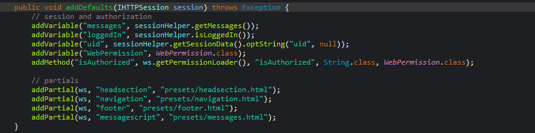

#  HTML Template Engine - Billing-Interface     
Die leichtgewichtige, implementierte HTML Template Engine ist von Jinja2 inspiriert.



---

## 📌 Überblick

**Die Template Engine** unterstützt:

- Variablen
- Methodenaufrufe
- Method-Chaining
- Bedingungen
- Iteratoren
- Partials (Template-Includes)

## Anwendung

### Variablen

Variablen werden mit '{{ variable }}' eingebunden.
**Standardvariablen:**
- messages
- loggedIn
- uid
- WebPermission

Beispiel:
` <p>User-ID: {{ uid }}</p> `

### Bedingungen

Syntax:

```

	...

	...

```

Unterstützt:
- Boolean-Variablen
- Methoden
- Method-Chaining
- Vergleichsoperatoren (`==`, `!=`, `>`, `<`, `>=`, `<=`)

### Iteratoren

Syntax:

```

	

```
oder bei dictionaries:

```

	: 

```

### Methoden

Methoden können im Backend registriert werden. 
Dazu wird der `Syntax` angegeben, das `Besitzer-Objekt`, der tatsächliche `Methodenname`, sowie die erwarteten `Parametertypen`.

Bsp.:

```
addMethod("isAuthorized", ws.getPermissionLoader(), "isAuthorized", String.class, WebPermission.class);
);
```
im Template:

```

	<p>Zugriff erlaubt</p>

```

### Partials
Partials sind einbindbare Template-Fragmente:
`addPartial(ws, "navigation", "presets/navigation.html");`
Im Template:
`{{ navigation }}`

### Backend-Integration

In WebRouten kann ein Template folgendermaßen gerendert werden:

```
@Override
public Response onRequest(IHTTPSession session, String body, SessionHelper sessionHelper) throws Exception {
    SimpleTemplating template = new SimpleTemplating(this.ws, sessionHelper);

    t.addVariable("condition", false);

    return ws.serveTemplate("not_found.html", session, template);
}
```


